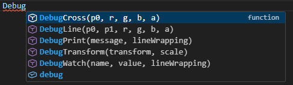
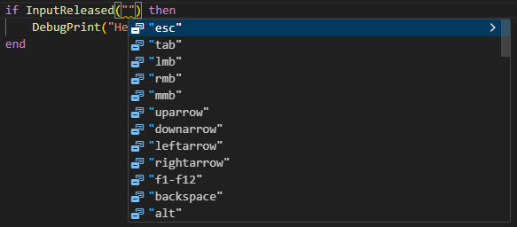

# Teardown Lua API

A Visual Studio Code extension which adds intellisense for most features in the [Teardown scripting API (2.0.0 // Experimental)](https://teardowngame.com/experimental/api.html).

This version uses custom-created lua definitions based on the current web documentation.

Currently contains `27` files/categories with definitions for a total of `606` functions and `16` aliases, as well as classes like `server`, `client`, `Vec3` and `Quat`.

Other features:
- support for `#include "<path>"` syntax.
- quick-fix action for missing imports.

## Examples
Code completion for function names

---
Code completion for parameters

---
Info on hover

---

## Usage

Opening a workspace with an `info.txt` for the first time with the extension installed, you should get a popup in the bottom right which lets you enable intellisense.

It can always be enabled/disabled in the extension settings for the current workspace.

**Important:** The extension only turns on if it finds an `info.txt` file in the root folder of the workspace when opened. If you add the file afterwards, simply reopen the editor and the popup should appear.

## Installation

I will try to get this on the VSCode extension marketplace at some point, but for now you can install it using the included `.vsix` file.
> Open the **extensions** tab, then click on the three dots in the top right `⋯`, then select **`Install from VSIX...`**

## Settings:

- **`Enable Scripting API`** : Enables or disables the Teardown scripting API intellisense for this project.
- **`Show Prompt`** :
  - **In User Settings:** Whether to show the popup when opening a valid workspace for the first time.
  - **In workspace settings:** Used by the extension to make sure the popup is only shown once, if enabled in user settings.
- **`Teardown Directory`** : Path to the Teardown installation directory. Used to get built-in definitions as fallback for ones not included in this extension.

## How it works

The extension adds `.meta.lua` files to the Lua Language Server's workspace library. This does not add, modify or remove any files from your project, it just tells VS Code that the type definitions are part of the workspace.

Currently, the only requirement for a Teardown mod is having an `info.txt` in the root folder. But since a folder with an `info.txt` file isn't guaranteed to be a Teardown mod, I've chosen to go with this popup prompt approach. Hopefully I can replace this with a better solution in the future.

### Note:

Teardown already has lua definitions included in the game files under `Teardown`/`Data`/:
- `script_defs.lua`
- `voxscript_defs.lua`
- `script`/`include`/`common.lua`
- `script`/`include`/`player.lua`

This extension expands on these with definitions containing all the information found in the web documentation, like descriptions and code examples.

---

### Feedback:
This is my first VS Code extension, and also my first public coding project, so you might encounter some mistakes.

If you have any issues, suggestions or advice, feedback is always appreciated.

---

## Links
- [Teardown Game](https://teardowngame.com) - The game this is for
- [Teardown API (Experimental)](https://teardowngame.com/experimental/api.html) - docs for the scripting API

## Changelog

See [commit history](https://github.com/GhoustUser/Teardown-Intellisense/commits/master/) for changes.
